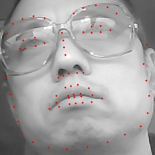
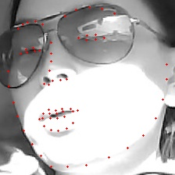

# 2D-face-landmark-localization
This repository contains the code of 2D face landmark localization with PyTorch

## To run this code, you need to have following libraries:

* [OpenCV](https://opencv.org/) - We tested our code with version > 3.0;
* [PyTorch](http://pytorch.org/) - We tested with v0.4.0;
* [Numpy](https://www.numpy.org.cn)- We tested with 1.10.0;
* Python - We tested our code with Pythonv3. If you are using Python v2, please feel free to make necessary changes to the code;

## Training, evaluate and export.
Before training started, make sure the following requirements.
- Training dataset and Test dataset must should be crop the face with some face detection algorithm such as dlib and so on.
- We should have a file list which contains the image name and landmark's coordinates such as: **face_01.jpg, 1,2,3,4,5,6 ..**.
- You should argument you dataset with scael, mirror, affine, and I have put those code in the file of **data_prepare**.

The following example shows how to train the code:

``` 
bash
# From the repo's root directory
# Training the code
sh run.sh
```

```
bash
# From the repo's root directory
# test the model
sh eval.sh
```

## The result



## License

This project is licensed under the MIT License - see the [LICENSE.md](LICENSE.md) file for details


